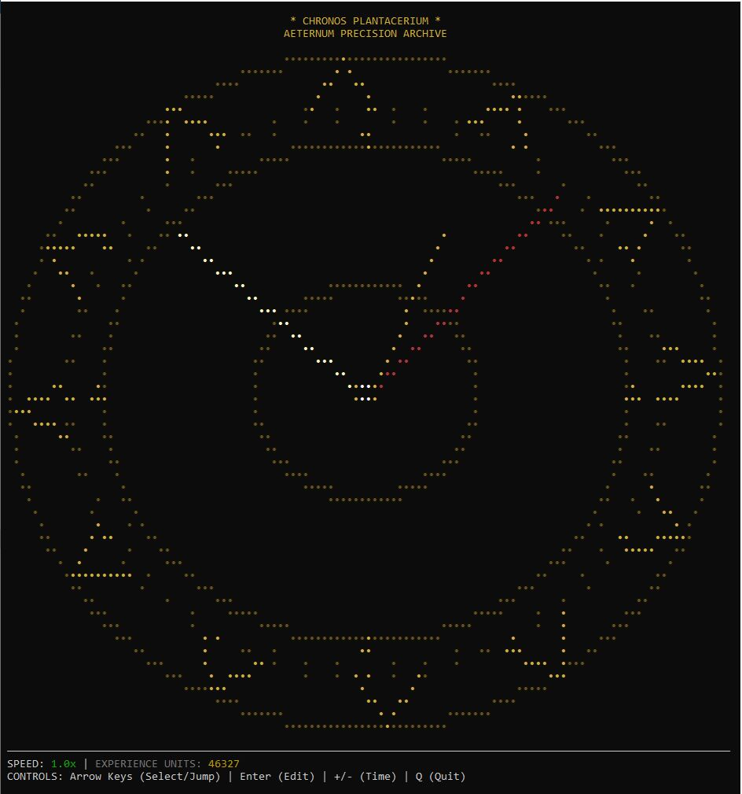
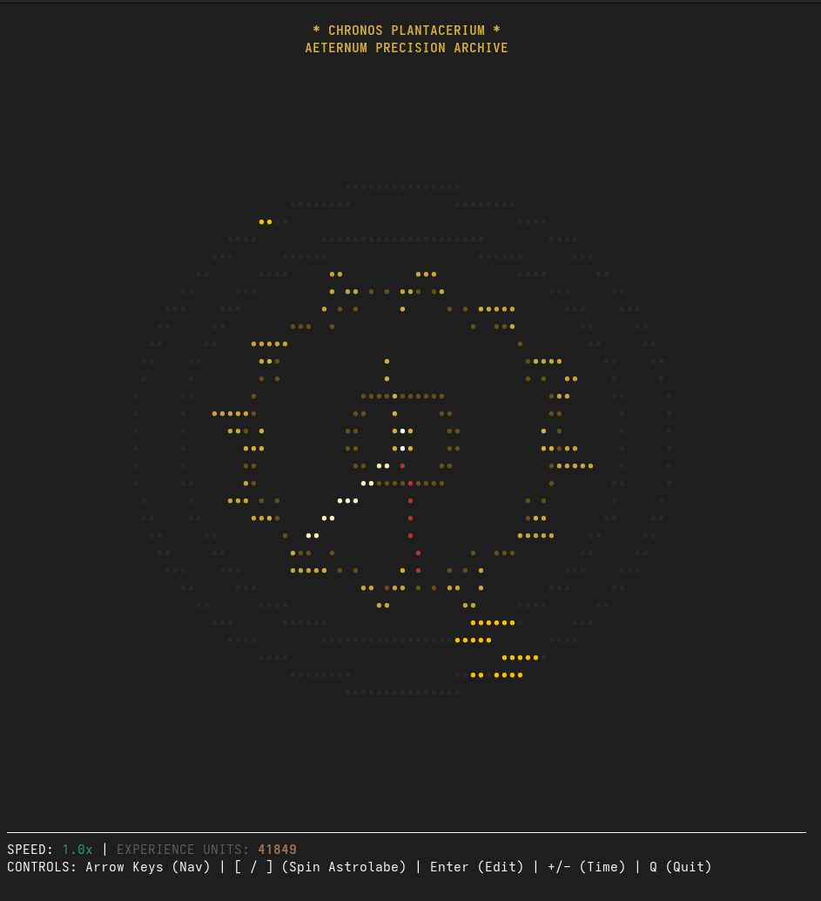
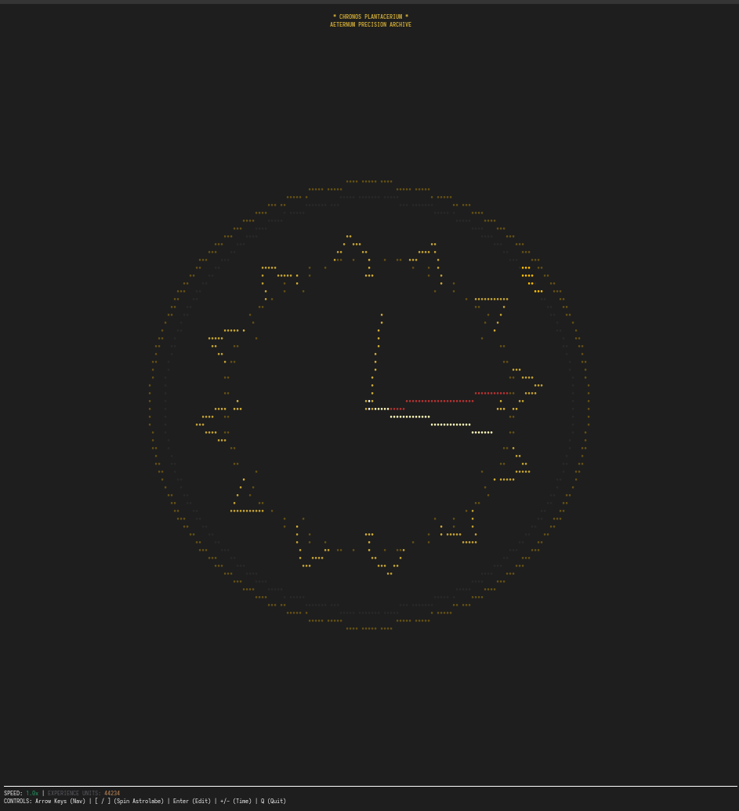

```text
+---------------------------------------------------------------------------+
|                                                                           |
|   ______ _                                                                |
|  / ____/| |__  _ __ ___  _ __   ___  ___                                  |
| | |     | '_ \| '__/ _ \| '_ \ / _ \/ __|                                 |
| | |____ | | | | | | (_) | | | | (_) \__ \                                 |
|  \_____||_| |_|_|  \___/|_| |_|\___/|___/                                 |
|                                                                           |
|          ⚜️  C H R O N O S   P L A N T A C E R I U M  ⚜️                   |
|                                                                           |
+---------------------------------------------------------------------------+
```
### *Aeternum Precision Archive — The Meditative Breath of Time.*

[](https://www.rust-lang.org/)
[]()
[](https://ratatui.rs)
[](https://github.com/crossterm-rs/crossterm)
[](https://tokio.rs)

**Chronos Plantacerium** is a sacred horological instrument designed to transform the ephemeral passage of time into a permanent inventory of human experience. It is a **Digital Zen Time Garden**—a space where every minute is a petal, and every note is a seed of consciousness.

---

## [SYSTEM_OVERVIEW V1]



## 🕰️ Chronos Aeternum - Update - The Dendrochronology of Being - Tree Rings.

**Chronos Aeternum** is a meditative Terminal User Interface (TUI) that reimagines time not as a linear arrow of productivity, but as a growing organism. It is a "Meditative Watch" that uses **Git-inspired history** and **Nature-mimicking growth** to visualize the depth of your presence.

---

## [SYSTEM_OVERVIEW V2]
* Zoom In



* Zoom Out

## 🌿 The Vision: From Chronos to Kairos

Most digital clocks represent *Chronos*—sequential, quantitative time that "runs out." This project captures *Kairos*—the qualitative "opportune moment."

By mapping your meditative notes onto tree rings, the TUI transforms a standard `git log` into **Dendrochronology**. Just as a tree records years of drought or plenty in the thickness of its rings, **Chronos Aeternum** records the frequency of your mindfulness in the density of its "Amber Nodes".

### Biomimicry Principles:

* **Dendrochronology**: Every unique calendar date () births a new layer of "Heartwood," expanding the tree outward.
* **Amber Encapsulation**: Notes are not just data; they are moments "frozen in resin" at a specific angular coordinate in space-time.
* **Bioluminescent Resonance**: When the present moment (Live Time) aligns with the minute of a past meditation, the TUI pulses with light, signaling a temporal connection between your past and present selves.

---

### � MEDITATIVE GEOMETRY
The **Vault of Flow** is a high-fidelity environment designed to induce a state of temporal presence.

*   **The Golden Breath**: Concentric energy rings follow a **4-1-8 breathing cycle** (Inhale 4s, Hold 1s, Exhale 8s), visually guiding your own respiration while you observe the archive.
*   **Vector Lotus Crown**: 12 precision-carved petals rotate in a grounding reverse-orbit, framing the clock with sacred geometry.
*   **Gilded Spirit Beacon**: A solitary point of light that tracks the exact minute, moving with the fluid grace of a floating petal on a still pond.
*   **Chromatic Stillness**: A curated palette of Royal Gold and Deep Void designed to minimize cognitive load and maximize focus.

---

## [THE_RITUAL_OF_ARCHIVING]

Usage of the Plantacerium is intended as a daily ritual of presence.

1.  **CENTER**: Align your breathing with the 4-1-8 expansion of the golden rings.
2.  **NAVIGATE**: Use Arrow Keys to gently drift through the 60 minutes of the hour.
3.  **LEAP**: Use Up/Down keys to jump between rings.
4.  **INVOKE**: Press `Enter` to open the memory vault.
5.  **PLANT**: Record your presence. Use **Markdown** to structure your thoughts like architecture.
6.  **SEAL**: Press `Esc` to lock the node. Your memory is now banked in the **Minute-Level Key** (`YYYY-MM-DD-HH-mm`).

---

## [TECHNICAL_ILLUMINATION]

```ini
[ESSENCE]
CORE       = "Rust (Stability of the Earth)"
UI_ENGINE  = "Ratatui (Flow of the Terminal)"
PERSIST    = "Serde / JSON (The Eternal Script)"
VISUALS    = "Software-Shader (The Digital Aura)"

[THE_CUES]
NAVIGATE   = "Left/Right (Inner Ring) | Up/Down (Outer Rings)"
SPIN ASTROLABE = [ / ](Rotate the wheel of history to find temporal alignments)
OPEN_VAULT = "Enter"
SEAL_NODE  = "Esc (Preserve Logic)"
DILATION   = "+/- (Stretch the Moment by 0.1x)"
QUIT       = "Q / q (Return to the Void)"
```

---

## [INITIATION_SEQUENCE]

Prepare your terminal for the descent into precision.

```bash
# Clone the gilded lotus
git clone https://github.com/plantacerium/ChronosAeternumTUI

# Enter the archival sanctuary
cd ChronosAeternumTUI

# Awaken the instrument
cargo run
```

---

## [THE_ZEN_OF_TIME]

> *"Feel the breath of the lotus. Every minute is a universe waiting for its chronicler."*

In the noise of the modern world, we often lose the 'weight' of our hours. By banking our experiences with **Minute-Precision**, we turn the ephemeral into the eternal. Each note is a golden petal dropped into the silent pool of the archive.

---
*Designed for the elite observer. Built with gold, breath, and precision.*
> "We are not just moving through time; we are growing through it."


